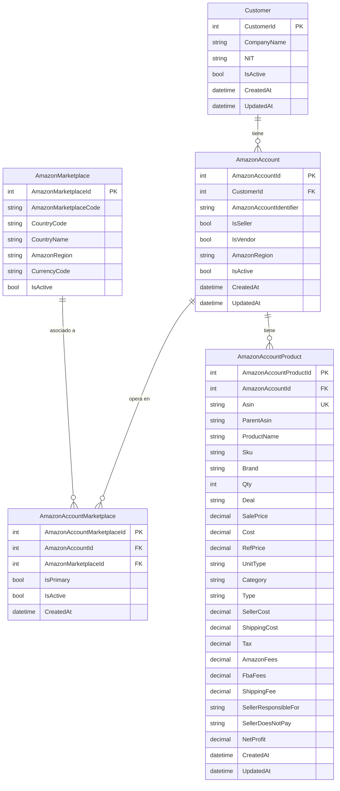

# Modelo Entidad-Relación: Customer, AmazonAccount y ASINs

Este documento describe las tablas y relaciones para ligar ASINs a cuentas Amazon de clientes, incluyendo tablas catálogo.

---

## Listado de campos y tabla donde van

| Campo | Tabla |
|-------|--------|
| ASIN | **Corporate.AmazonAccountProducts** |
| Product Name | **Corporate.AmazonAccountProducts** |
| ASIN Parent | **Corporate.AmazonAccountProducts** |
| SKU | **Corporate.AmazonAccountProducts** |
| Brand | **Corporate.AmazonAccountProducts** |
| QTY | **Corporate.AmazonAccountProducts** |
| Deal | **Corporate.AmazonAccountProducts** |
| Sale Price | **Corporate.AmazonAccountProducts** |
| Cost | **Corporate.AmazonAccountProducts** |
| Ref Price | **Corporate.AmazonAccountProducts** |
| Unit Type | **Corporate.AmazonAccountProducts** |
| Category | **Corporate.AmazonAccountProducts** |
| Type | **Corporate.AmazonAccountProducts** |
| Seller Cost | **Corporate.AmazonAccountProducts** |
| Shipping Cost | **Corporate.AmazonAccountProducts** |
| Tax | **Corporate.AmazonAccountProducts** |
| Amazon Fees | **Corporate.AmazonAccountProducts** |
| FBA Fees | **Corporate.AmazonAccountProducts** |
| Shipping Fee | **Corporate.AmazonAccountProducts** |
| The Seller is Responsible For | **Corporate.AmazonAccountProducts** |
| The Seller does not Pay | **Corporate.AmazonAccountProducts** |
| Net Profit | **Corporate.AmazonAccountProducts** |

**Resumen:** Los 22 campos del Excel van todos en la tabla **Corporate.AmazonAccountProducts** (más la FK **AmazonAccountId** y audit: **CreatedAt**, **UpdatedAt**).

---

## Estructura propuesta: AmazonAccountAsin

Estructura tipo catálogo Amazon con FKs a tablas de apoyo. Texto corregido respecto a tu borrador:

| Campo | Tipo | Clave | Notas |
|-------|------|--------|--------|
| AmazonAccountAsinId | int | PK | |
| AmazonAccountId | int | FK | |
| Asin | varchar(10) | | ASIN en Amazon son 10 caracteres; varchar(10) basta. |
| ProductTitle | varchar(500) | | *Corregido:* "Product Title" → ProductTitle (sin espacio). |
| ManufacturerCode | varchar(40) | | |
| ParentAsin | varchar(10) | | *Corregido:* ParentASIN → ParentAsin (misma longitud que Asin). |
| Upc | varchar(20) | | UPC suele ser numérico corto; 200 es mucho, 20 suele bastar. |
| Ean | varchar(20) | | Igual que Upc. |
| Isbn | varchar(20) | | ISBN-13 son 13 caracteres. |
| ModelNumber | varchar(100) | | |
| CategoryId | int | FK | Crear tabla **Categories** (o ProductCategories). |
| SubCategoryId | int | FK | Crear tabla **SubCategories**. |
| ProductGroupId | int | FK | *Corregido:* ProductGroup → **ProductGroupId** (si es FK, conviene el sufijo Id). Crear tabla **ProductGroups**. |
| ReleaseDate | datetime | | |
| ReplenishmentCategoryId | int | FK | Crear tabla **ReplenishmentCategories**. |
| PrepInstructionsRequired | varchar(200) | | |
| PrepInstructionsVendorState | varchar(200) | | |
| CreatedDate | datetime | | *Corregido:* CreateDate → **CreatedDate** (consistente con ModifiedDate). |
| CreatedBy | varchar(60) | | *Corregido:* CreateBy → **CreatedBy**. |
| ModifiedDate | datetime | | |
| ModifiedBy | varchar(60) | | |

**Tablas a crear (catálogos):** Categories, SubCategories, ProductGroups, ReplenishmentCategories.

**Resumen de correcciones:** Product Title → ProductTitle; CreateBy → CreatedBy; CreateDate → CreatedDate; ProductGroup (FK) → ProductGroupId; ASIN/ParentASIN longitud varchar(10); UPC/EAN/ISBN longitudes más razonables.

---

## Qué te parece (breve)

- La estructura se entiende bien: identificadores (Asin, ParentAsin), datos de producto (ProductTitle, ManufacturerCode, UPC, EAN, ISBN, ModelNumber), clasificación por FKs (Category, SubCategory, ProductGroup, Replenishment) y auditoría (Created/Modified).
- Usar FKs a tablas catálogo (CategoryId, SubCategoryId, etc.) es adecuado para mantener valores consistentes y reportes por categoría.
- Si además necesitas los campos del Excel de precios/inventario (Sale Price, Cost, QTY, Deal, Net Profit, etc.), se pueden añadir en esta misma tabla **AmazonAccountAsin** o en una tabla complementaria por cuenta (por ejemplo **AmazonAccountAsinDetail**) según prefieras un solo registro por ASIN o historial por fecha.

---

## Diagrama entidad-relación (Mermaid)



---

## Listado completo: campos del Excel → tabla donde quedan

Campos y ejemplos según la captura del Excel que compartiste (22 columnas):

| # | Campo del Excel | Tabla | Columna en BD | Ejemplo |
|---|-----------------|--------|----------------|---------|
| 1 | **ASIN** | AmazonAccountProducts | **Asin** | B0818K2G87, B011933T3A |
| 2 | **Product Name** | AmazonAccountProducts | **ProductName** | OMRON B.P MONITOR (HEM-7120) WITH ADAPTOR |
| 3 | **ASIN Parent** | AmazonAccountProducts | **ParentAsin** | B0818K2G87, B011933T3A |
| 4 | **SKU** | AmazonAccountProducts | **Sku** | VHBPP999, VHPB10000BK |
| 5 | **Brand** | AmazonAccountProducts | **Brand** | Omron, OMG |
| 6 | **QTY** | AmazonAccountProducts | **Qty** | 30, 50, 30 |
| 7 | **Deal** | AmazonAccountProducts | **Deal** | NO DEAL |
| 8 | **Sale Price** | AmazonAccountProducts | **SalePrice** | 0.00 |
| 9 | **Cost** | AmazonAccountProducts | **Cost** | 1500, 500 |
| 10 | **Ref Price** | AmazonAccountProducts | **RefPrice** | 1800, 600 |
| 11 | **Unit Type** | AmazonAccountProducts | **UnitType** | UNIT |
| 12 | **Category** | AmazonAccountProducts | **Category** | HEALTH & BEAUTY, ELECTRONICS |
| 13 | **Type** | AmazonAccountProducts | **Type** | B.P Monitor, Power bank, Wireless Headphone |
| 14 | **Seller Cost** | AmazonAccountProducts | **SellerCost** | 800.00, 200.00 |
| 15 | **Shipping Cost** | AmazonAccountProducts | **ShippingCost** | 0.00 |
| 16 | **Tax** | AmazonAccountProducts | **Tax** | 0.00 |
| 17 | **Amazon Fees** | AmazonAccountProducts | **AmazonFees** | 0.00 |
| 18 | **FBA Fees** | AmazonAccountProducts | **FbaFees** | 0.00 |
| 19 | **Shipping Fee** | AmazonAccountProducts | **ShippingFee** | 0.00 |
| 20 | **The Seller is Responsible For** | AmazonAccountProducts | **SellerResponsibleFor** | PACKING, INVOICE, SHIPPING TO CLIENT |
| 21 | **The Seller does not Pay** | AmazonAccountProducts | **SellerDoesNotPay** | WAREHOUSING, SALES, TAX |
| 22 | **Net Profit** | AmazonAccountProducts | **NetProfit** | 0.00 |

Todos estos campos van en **Corporate.AmazonAccountProducts** (más AmazonAccountId, CreatedAt, UpdatedAt). En este Excel no se usan catálogos (ListingStatuses, Currencies, ProductCategories); Category y Type van como texto. Si más adelante quieres normalizarlos, se pueden agregar catálogos.

---

| Entidad origen   | Cardinalidad | Entidad destino         | Descripción |
|------------------|-------------|--------------------------|-------------|
| **Customer**     | 1 : N       | **AmazonAccount**        | Un cliente tiene una o varias cuentas Amazon. |
| **AmazonAccount**| N : N       | **AmazonMarketplace**    | Una cuenta opera en varios marketplaces; se relacionan por **AmazonAccountMarketplace**. |
| **AmazonAccount**| 1 : N       | **AmazonAccountProduct** | Una cuenta tiene muchos ASINs/productos (campos del Excel). |

---

## Tablas existentes (ya en el proyecto)

- **Corporate.Customers** – Clientes de la consultora.
- **Corporate.AmazonAccounts** – Cuentas Amazon; cada una pertenece a un **Customer**.
- **Corporate.AmazonMarketplaces** – Catálogo de marketplaces (US, MX, etc.).
- **Corporate.AmazonAccountMarketplaces** – Tabla intermedia: qué cuenta opera en qué marketplace.

---

## Tablas nuevas propuestas

### 1. **Corporate.AmazonAccountProducts** (tabla principal de ASINs)

Almacena los ASINs ligados a cada **AmazonAccount**. Cada fila = un producto (ASIN) de esa cuenta. Columnas según tu Excel:

| Campo | Tipo | Obligatorio | Descripción / ejemplo |
|-------|------|-------------|------------------------|
| AmazonAccountProductId | int (PK) | Sí | Identificador interno. |
| AmazonAccountId | int (FK) | Sí | Cuenta Amazon a la que pertenece el ASIN. |
| **Asin** | varchar(10) | **Sí** | ASIN del producto (ej. B0818K2G87). Único por cuenta. |
| **ParentAsin** | varchar(10) | No | ASIN padre si es variación (ej. B0818K2G87). |
| **ProductName** | varchar(500) | Sí | Nombre del producto (ej. OMRON B.P MONITOR...). |
| **Sku** | varchar(50) | No | SKU (ej. VHBPP999, VHPB10000BK). |
| **Brand** | varchar(100) | No | Marca (ej. Omron, OMG). |
| **Qty** | int | No | Cantidad (ej. 30, 50). |
| **Deal** | varchar(50) | No | Estado de oferta (ej. NO DEAL). |
| **SalePrice** | decimal | No | Precio de venta (ej. 0.00). |
| **Cost** | decimal | No | Costo (ej. 1500, 500). |
| **RefPrice** | decimal | No | Precio de referencia (ej. 1800, 600). |
| **UnitType** | varchar(20) | No | Unidad (ej. UNIT). |
| **Category** | varchar(100) | No | Categoría (ej. HEALTH & BEAUTY, ELECTRONICS). |
| **Type** | varchar(100) | No | Tipo de producto (ej. B.P Monitor, Power bank). |
| **SellerCost** | decimal | No | Costo del vendedor (ej. 800.00, 200.00). |
| **ShippingCost** | decimal | No | Costo de envío. |
| **Tax** | decimal | No | Impuesto. |
| **AmazonFees** | decimal | No | Comisiones Amazon. |
| **FbaFees** | decimal | No | Tarifas FBA. |
| **ShippingFee** | decimal | No | Tarifa de envío. |
| **SellerResponsibleFor** | varchar(500) | No | Lo que el vendedor es responsable (ej. PACKING, INVOICE, SHIPPING TO CLIENT). |
| **SellerDoesNotPay** | varchar(500) | No | Lo que el vendedor no paga (ej. WAREHOUSING, SALES, TAX). |
| **NetProfit** | decimal | No | Ganancia neta (ej. 0.00). |
| CreatedAt | datetime | Sí | Alta del registro. |
| UpdatedAt | datetime | No | Última actualización. |

- **Índice único:** `(AmazonAccountId, Asin)` para no duplicar ASINs por cuenta.

---

### 2. **Corporate.ListingStatuses** (catálogo, opcional)

No usado en el Excel actual. Si en otro reporte tienes un campo *Status*, se puede usar este catálogo y una FK desde AmazonAccountProducts.

| Campo           | Tipo        | Descripción |
|-----------------|------------|-------------|
| ListingStatusId | int (PK)   | Id. |
| StatusCode      | varchar(20)| Código (ej. Active, Inactive). |
| StatusName      | varchar(100)| Nombre para mostrar. |
| IsActive        | bit        | Vigente. |

---

### 3. **Corporate.Currencies** (catálogo, opcional)

No usado en el Excel actual (los precios van sin moneda explícita). Útil si más adelante importas datos con Currency.

| Campo        | Tipo        | Descripción |
|-------------|------------|-------------|
| CurrencyId   | int (PK)   | Id. |
| CurrencyCode | varchar(3) | Código ISO (USD, EUR, MXN). |
| CurrencyName | varchar(50)| Nombre. |
| IsActive     | bit        | Vigente. |

---

### 4. **Corporate.ProductCategories** (catálogo, opcional)

En tu Excel, **Category** y **Type** van como texto en AmazonAccountProducts. Si quieres normalizarlos después, puedes usar este catálogo y una FK.

| Campo             | Tipo         | Descripción |
|-------------------|-------------|-------------|
| ProductCategoryId | int (PK)    | Id. |
| CategoryCode      | varchar(50) | Código interno. |
| CategoryName      | varchar(200)| Nombre (ej. HEALTH & BEAUTY). |
| ProductTypeName   | varchar(100)| Tipo (ej. B.P Monitor, Power bank). |
| IsActive          | bit         | Vigente. |

---

## Esquema visual simplificado

```
Customer (1) ──────────────── (N) AmazonAccount
                                    │
                                    ├──────────── (N) AmazonAccountMarketplace ──── (N) AmazonMarketplace
                                    │
                                    └──────────── (N) AmazonAccountProduct
                                                        (22 campos del Excel + audit)
```

---

## Notas

- Los 22 campos del Excel están mapeados 1:1 en **AmazonAccountProduct**.
- **Brand** en **AmazonAccountProduct** se deja como texto por ahora; si más adelante quieren normalizar marcas, se puede agregar **Corporate.Brands** y una FK.
- **Currency**: si ya existe o planean una tabla global de monedas, **AmazonAccountProduct** puede apuntar a esa tabla en lugar de duplicar **Corporate.Currencies**.
- **AmazonAccountProduct** es el nombre propuesto para la entidad; a nivel de negocio sigue siendo “ASIN por cuenta”. El nombre evita confusión con un posible catálogo global de productos en el futuro.
